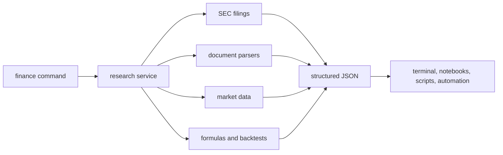

<h1 align="center">Finance CLI</h1>

<p align="center">
  Public-company research from the terminal.
</p>

<p align="center">
  <a href="https://pypi.org/project/finresearch-cli/"></a>
  
  
</p>

Finance CLI helps analysts, quants, and research workflows pull SEC filings, read PDFs and HTML, extract filing tables, run finance formulas, fetch market context, and test VectorBT strategies from one command-line interface.

It is designed for repeatable public-company research: commands in, structured output out.

## Why This Exists

You can already combine notebooks, yfinance, SEC downloads, PDF parsers, spreadsheet formulas, and backtesting libraries by hand. That works until every company or question needs a slightly different glue script.

Finance CLI packages those recurring research steps into terminal commands with consistent JSON output. The goal is not to hide the underlying sources. It is to make common research moves easy to repeat, inspect, diff, and automate.

Use it when you want to:

- pull a 10-K section without rewriting EDGAR retrieval code
- inspect filing tables without manually searching raw HTML
- scan a long filing and keep stable offsets for follow-up reading
- run finance formulas with explicit inputs and methods
- fetch market context from the same command surface as filings and documents
- run quick strategy checks without starting from a blank notebook

## Install

```bash
python -m pip install -U finresearch-cli
```

From a local checkout:

```bash
git clone https://github.com/TempestShaw/FinanceCLI.git
cd FinanceCLI
python -m pip install -U .
```

Check the install:

```bash
finance --list
finance sources.status --output json
```

The default install includes SEC filing access, PDF parsing, Camelot table extraction, PaddleOCR fallback, Yahoo market data, finance formulas, and VectorBT backtests.

## First Minute

```bash
finance filings.recent AAPL forms=10-K,10-Q limit=3
finance filings.statement COST statement=balance query="Common Stock"
finance formula.margin numerator=11969 denominator=254453
finance market.quote AAPL
finance backtest.run sma_cross AAPL 2020-01-01 2024-12-31 fast=20 slow=100
```

Most commands return JSON by default:

```json
{
  "ok": true,
  "data": {
    "margin": 0.04703815635893466,
    "margin_pct": 4.7038156358934655,
    "inputs": {
      "numerator": 11969.0,
      "denominator": 254453.0
    },
    "method": "numerator / denominator"
  },
  "error": null,
  "warnings": []
}
```

Use `--output text` for readable terminal output when a command supports it.

## Mental Model



Commands are grouped by research job:

| Namespace | Use it for |
| --- | --- |
| `filings.*` | SEC filings, filing sections, XBRL statements, and filing reports. |
| `document.*` | PDF/HTML reading, text search, windows, table extraction, and OCR. |
| `market.*`, `price.*`, `news.*` | Quotes, OHLCV, market moves, regimes, sectors, and news context. |
| `transcripts.*`, `kpi.*`, `ir.*` | Earnings transcripts, KPI evidence, and investor presentations. |
| `formula.*`, `valuation.*`, `estimates.*` | Finance formulas, DCF/NPV/IRR, multiples, scenarios, and consensus estimates. |
| `backtest.*` | VectorBT strategy runs, tuning, custom strategy files, and factor payload helpers. |

## Automation Workflows

Finance CLI works well in local scripts, notebooks, CI jobs, and research automation because commands are small, explicit, and machine-readable.

The document examples below assume a filing or report has been saved locally as `./filing.html`.

```bash
finance document.scan ./filing.html format=html query="operating lease costs" window=1200
finance document.window ./filing.html format=html match_id=char_52000_52200 direction=next chars=4000
finance filings.statement COST statement=balance query="Common Stock"
finance formula.net_debt debt=11415 cash=11144 operating_cash=5089
```

A typical automated research workflow is:

1. discover the filing or presentation
2. scan for the relevant section, metric, table, or phrase
3. continue reading from a stable match id or character window
4. calculate the metric with explicit inputs
5. preserve the command and JSON output as audit trail

## What You Can Do

| Task | Example |
| --- | --- |
| Find recent filings | `finance filings.recent NVDA forms=10-Q,8-K limit=5` |
| Read a 10-K section | `finance filings.read AAPL section=mda max_chars=4000` |
| Search filing text | `finance document.scan ./filing.html format=html query="lease liabilities"` |
| Extract PDF tables | `finance document.tables ./report.pdf pages=10-12 flavor=stream` |
| OCR a scanned deck | `finance document.ocr ./deck.pdf max_pages=3` |
| Pull market data | `finance market.ohlcv NVDA timeframe=1d limit=20` |
| Calculate finance metrics | `finance formula.net_debt debt=11415 cash=11144 operating_cash=5089` |
| Run a backtest | `finance backtest.run sma_cross AAPL 2020-01-01 2024-12-31 fast=20 slow=100` |

More examples are in [EXAMPLES.md](EXAMPLES.md).

## Trust Model

Finance research needs traceable inputs. Finance CLI is built around a few practical rules:

- Source handles: filing commands return accessions, URLs, report names, sections, offsets, or provider names when available.
- Explicit calculations: formula commands include the inputs and method used.
- Scriptable results: commands return predictable JSON with `ok`, `data`, `error`, and `warnings` fields.
- Local credentials: API keys are read from environment variables at runtime and are not written by the CLI.
- No telemetry: the CLI does not track commands, symbols, queries, or usage.
- Freshness: provider-backed commands reflect the source response at runtime; there is no general stale-cache layer.

## Why Not Just A Notebook?

| Research job | Notebook-first workflow | Finance CLI workflow |
| --- | --- | --- |
| Pull a 10-K section | Write SEC lookup, filing selection, parser setup, and cleanup code. | `finance filings.read AAPL section=mda` |
| Inspect a filing table | Search raw HTML or build one-off XBRL/table parsing. | `finance filings.statement COST statement=balance query="Common Stock"` |
| Continue reading a long document | Copy text into cells and lose the original location. | `finance document.window ./filing.html match_id=char_52000_52200 direction=next` |
| Reuse finance formulas | Reimplement formulas and unit conventions in each notebook. | `finance formula.roic nopat=7113 invested_capital=28077` |
| Run a quick strategy check | Build the data fetch, signals, portfolio, and metrics before testing the idea. | `finance backtest.run sma_cross AAPL 2020-01-01 2024-12-31` |
| Make research reproducible | Commit notebooks with hidden state and noisy diffs. | Commit commands, JSON outputs, and CI checks as plain text. |

Notebooks are still useful for exploration and visualization. Finance CLI is for the repeated research steps you want to make portable, auditable, and easy to run again.

## Data Sources And Keys

Many commands work without a paid key. Some provider-backed commands use environment variables:

| Variable | Enables |
| --- | --- |
| `FMP_API_KEY` | Financial Modeling Prep consensus estimates. |
| `ALPHAVANTAGE_API_KEY` or `ALPHA_VANTAGE_API_KEY` | Alpha Vantage market data fallback. |
| `ALPACA_API_KEY` and `ALPACA_API_SECRET` | Alpaca market-data fallback. |

SEC filing, document, formula, table, OCR, Yahoo market data, and local backtest commands are available from the default install.

## Help

```bash
finance help filings
finance filings.statement --help
finance document.scan --help
```

## Disclaimer

Finance CLI is for research and automation workflows only. It is not financial advice, investment advice, tax advice, or a recommendation to buy or sell securities.
